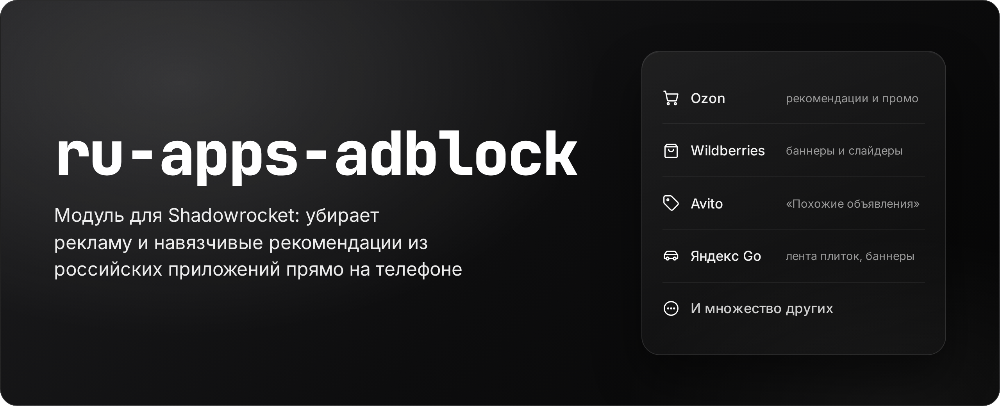

[](https://github.com/Melidovskiy/ru-apps-adblock/actions/workflows/test.yml)
[](ru-adblock.js)
[](RU-Apps-AdBlock.sgmodule)
[](LICENSE)

Модуль и скрипт для [Shadowrocket](https://apps.apple.com/app/shadowrocket/id932747118) (iOS), которые убирают рекламу и навязчивые рекомендации из популярных российских приложений: Ozon, Wildberries, Яндекс Маркета, Яндекс Go, Avito, СДЭК, Почты России, AliExpress и DDX Fitness.

Вся обработка идёт **на вашем телефоне**: скрипт получает ответ сервера приложения, вырезает из него рекламный блок и отдаёт приложению остальное. Никуда, кроме серверов самих приложений, данные не отправляются.

> Проект независимый и не связан с перечисленными сервисами. Названия сервисов и товарные знаки принадлежат их правообладателям и используются только для указания совместимости.

## Содержание

- [Что убирается](#что-убирается)
- [Установка](#установка)
- [Как это работает](#как-это-работает)
- [Безопасность и приватность](#безопасность-и-приватность)
- [Ограничения](#ограничения)
- [Если что-то сломалось](#если-что-то-сломалось)
- [Правовая информация](#правовая-информация)

## Что убирается

Во всех поддерживаемых приложениях — рекламные карточки и баннеры с обязательной маркировкой (токен `erid`, пометка «Реклама» / «Ad»). Кроме того, для отдельных экранов есть свои правила:

| Приложение | Что ещё убирается |
|---|---|
| **Wildberries** | баннеры и слайдеры (выключаются в настройках приложения), рекламная шапка главной, лента «Selected for you» и рекомендации в «Мой WB»; в WB Кошельке — промо-карусель Банка («Накопительный счёт» и соседние карточки) |
| **Ozon** | в профиле — лента «Подобрали по вашим интересам», слайдер «Товары за 1 ₽», промо-плашка внизу, «Лента обзоров»; в избранном и корзине — «Подобрали для вас», «Вы смотрели»; баннер-карусель вкладки банка. Главная Ozon не меняется |
| **Яндекс Маркет** | «Достойны сердечка» в избранном, «Может пригодиться» в корзине |
| **Яндекс Go** | лента плиток с товарами и ресторанами на главной, рекламный баннер на экране доставки |
| **Avito** | «Похожие объявления» и рекламные места в избранном |
| **СДЭК** | блок «Реклама · Горячие предложения» на главной (раздел «Шопинг» не трогается) |
| **Почта России** | карусель рекламных баннеров и места рекламы Яндекса на главной, «Спецпредложения» |
| **AliExpress** | на главной — полка «Звёздные купоны» и витрины брендов; в ленте «Для вас» — рекламные товары (оставшиеся снова идут по два в ряд); в профиле и корзине — «Товары от партнеров», «Вы смотрели», «Одна цена», «Рекомендуем вам» |
| **DDX Fitness** | карусель баннеров и сторис на главной |

Также блокируются рекламные и трекинговые сервисы: AppMetrica, Adjust, AppsFlyer, рекламная сеть Яндекса, рекламная платформа СДЭК, аналитика Avito и WB и другие (полный список — в разделе `[Rule]` модуля).

## Установка

Нужен iPhone с установленным Shadowrocket.

### 1. Включите расшифровку HTTPS

Без неё скрипт не видит ответы приложений.

1. Shadowrocket → **Настройки** → **Расшифровка HTTPS** (HTTPS Decryption) → **Сгенерировать новый сертификат**.
2. **Установить сертификат** → разрешите загрузку профиля.
3. Настройки iOS → **Основные** → **VPN и управление устройством** → установите загруженный профиль.
4. Настройки iOS → **Основные** → **Об этом устройстве** → **Доверие сертификатам** → включите доверие для сертификата Shadowrocket.
5. Вернитесь в Shadowrocket и включите переключатель **Расшифровка HTTPS**.

Названия пунктов могут немного отличаться в зависимости от версий iOS и Shadowrocket.

### 2. Установите модуль

Shadowrocket → **Настройки** → **Модули** → **＋** → вставьте ссылку и включите модуль:

```
https://raw.githubusercontent.com/Melidovskiy/ru-apps-adblock/main/RU-Apps-AdBlock.sgmodule
```

Отдельно добавлять `ru-adblock.js` не нужно: модуль сам загружает скрипт из этого репозитория (строки `script-path`). Модуль, установленный по ссылке, обновляется из репозитория; новая версия скрипта подтягивается сама.

Если хотите использовать свою копию скрипта, разместите `ru-adblock.js` у себя (например, в своём форке) и замените адрес во всех строках `script-path` модуля.

### 3. Перезапустите приложения

Полностью закройте приложения (смахните из списка открытых) и откройте снова. Shadowrocket обновляет скрипт не сразу: после обновления подождите до 5 минут. Часть правил Wildberries (баннеры и слайдеры) применяется со следующего запуска приложения.

## Как это работает

**Модуль** (`RU-Apps-AdBlock.sgmodule`) говорит Shadowrocket, что делать:

- `[Rule]` — блокирует рекламные и трекинговые хосты и запрещает QUIC (HTTP/3) для обрабатываемых хостов: иначе приложение пошло бы в обход расшифровки;
- `[Script]` — подключает скрипт к ответам нужных адресов;
- `[URL Rewrite]` — заменяет отдельные рекламные картинки прозрачными и отклоняет отдельные рекламные запросы;
- `[MITM]` — список хостов, трафик которых расшифровывается. Всё остальное Shadowrocket не расшифровывает.

**Скрипт** (`ru-adblock.js`) разбирает JSON-ответ и ищет маркировку рекламы. Найдя её, он поднимается к ближайшей карточке или баннеру с картинкой и удаляет именно этот элемент. Если после этого карусель опустела, убирается и она. Рекомендательные блоки находятся по названиям виджетов и заголовкам экранов.

Скрипт старается менять как можно меньше:

- ответ, в котором ничего не найдено, отдаётся без изменений;
- не удаляется слишком большой элемент, а если под удаление попадает больше 60% ответа, ответ, как правило, остаётся как есть (кроме ответов, которые целиком состоят из рекламы);
- длинные числовые идентификаторы (номера товаров, заказов) сохраняются точно: JavaScript не может хранить такие числа без округления, поэтому скрипт обрабатывает их отдельно.

История изменений — в комментарии в начале `ru-adblock.js`.

## Безопасность и приватность

- **Всё работает на телефоне.** Скрипт не отправляет данные третьим лицам. Единственные запросы, которые он делает сам, — повторы GET-запросов DDX Fitness к тому же серверу DDX (подробнее — в разделе «Ограничения»).
- **Расшифровывается только список из `[MITM]`.** Госуслуги, mos.ru, серверы банков и мессенджеры в него не входят. Исключения — WB Кошелёк (`finance.wb.ru`, `wb-wallet.wildberries.ru`) и вкладка банка в самом приложении Ozon (приходит через `api.ozon.ru`): там скрипт трогает только промо-блоки, не пишет в журнал ответы Кошелька целиком и не пишет операции.
- **Сертификат Shadowrocket — ваш ключ ко всему, что расшифровывается.** Не делитесь экспортом конфигурации Shadowrocket: в нём может оказаться этот сертификат вместе с закрытым ключом.
- **Скрипт обновляется автоматически** по адресу из `script-path`. Кто может изменить файл по этому адресу, тот определяет код, который видит расшифрованный трафик перечисленных хостов. Если не хотите доверять чужой копии, прочитайте код и разместите свою (см. «Установка»).
- **Журналы Shadowrocket содержат личные данные.** В модуле включена диагностика (`argument=debug`): скрипт пишет в журнал, что и где удалил. Сам журнал Shadowrocket (PacketTunnel) содержит адреса запросов, заголовки с токенами авторизации, номера телефонов. Не публикуйте журналы. Чтобы выключить диагностику, удалите `,argument=debug` из строк `[Script]` модуля.

## Ограничения

- **Приложения с проверкой сертификата** (certificate pinning) не работают с расшифровкой: они отклоняют сертификат Shadowrocket и перестают загружаться. Например, так устроен TikTok. Для таких приложений фильтрация невозможна.
- **Серверы на сертификатах российского удостоверяющего центра** Shadowrocket не может проверить. Поэтому, например, карусель на собственном экране Ozon Банка убрать нельзя.
- **Плашки «Включён VPN»** (Госуслуги, mos.ru, ЕМИАС, Мой МТС, Ozon Банк) рисует само приложение, когда видит VPN в системе. Модулем их не убрать. Если мешают, настройте в «Командах» iOS автоматизацию: при открытии этих приложений — «Настроить VPN» → «Отключить» Shadowrocket, при закрытии — «Подключить».
- **DDX Fitness.** При расшифровке крупные ответы сервера DDX обрываются (тренеры, видео, абонементы). Поэтому скрипт сам повторяет GET-запросы DDX к тому же серверу с обычной проверкой сертификата и отдаёт приложению полученный ответ. Если повтор не удался, запрос идёт как обычно.
- **Обновления приложений.** Правила привязаны к конкретным запросам и формату ответов. После обновления приложения что-то может перестать убираться, пока правила не обновят.

## Если что-то сломалось

1. **Выключите модуль** и перезапустите приложение. Если заработало, проблема в модуле.
2. **Уберите хост приложения из строки `hostname`** в разделе `[MITM]` модуля: приложение будет работать как без модуля (реклама в нём вернётся). Например, для DDX Fitness — `mobileapi.ddxfitness.ru`.
3. **Посмотрите журнал Shadowrocket.** Строки `[RU-AdBlock]` показывают, какой ответ обработан и что из него удалено.
4. **Сообщите о проблеме** через [Issues](https://github.com/Melidovskiy/ru-apps-adblock/issues/new/choose): шаблон подскажет, что приложить. Прикладывайте только строки `[RU-AdBlock]`, а не журнал целиком.

## Правовая информация

Код распространяется по лицензии MIT (файл `LICENSE`).

Фильтрация выполняется на устройстве пользователя и не изменяет данные на серверах сервисов.

Проект не предназначен для получения несанкционированного доступа к аккаунтам, серверам или платным функциям сервисов, а также для обхода систем DRM или иных механизмов контроля доступа.

Использование Shadowrocket, расшифровки HTTPS и сторонних модулей может регулироваться условиями использования соответствующего программного обеспечения и сервисов. Пользователь самостоятельно отвечает за соблюдение применимых условий и правил.

Проект предоставляется «как есть». Автор не гарантирует работоспособность правил после обновлений приложений и не несёт ответственности за изменения в работе сторонних сервисов, вызванные использованием проекта.

RU Apps AdBlock — независимый проект. Упоминание Ozon, Wildberries, Яндекса, Avito, СДЭК, Почты России, AliExpress, DDX Fitness и других сервисов не означает партнёрства, одобрения или иного отношения между ними и автором проекта.
